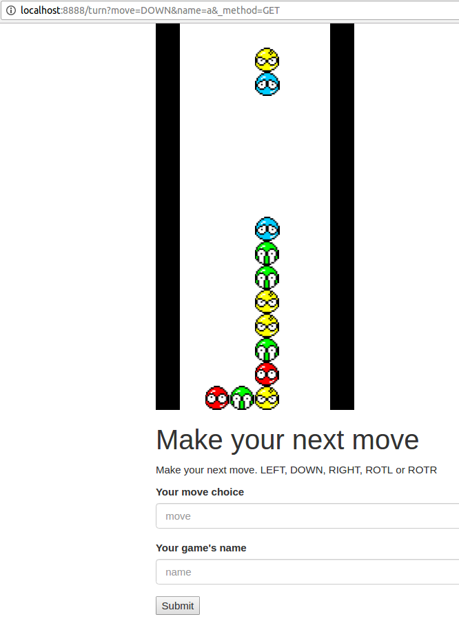

# Puyo-Platform



Puyo platform is a server intended to expose the game of puyo as an HTTP API in
order to propose Puyo Puyo as a coding contest.

Demonstration: currently running at [https://puyopuyo.vermeille.fr](https://puyopuyo.vermeille.fr)

## Solo mode

Contestants have to

1. Create their game on /new and name it
2. Play on /turn with the action they wish to do and the game's name

Those endpoints have an HTML browser friendly interface to manually dabble with
it, but also have a parser-friendly output if queried with the header `Accept:
text/plain`

Both of those plain text endpoints will answer with either

`ERROR` if something went wrong (most likely an invalid game ID), `LOST` if
you've lost the game, or an ASCII representation of the game following this
format

```
x_position_of_main_puyo  y_pos_of_main_puyo second_puyo_location
main_puyo_type second_puyo_type
game
```

where

* `0 <= x_position_of_main_puyo < 6`. Leftmost is 0, rightmost is 5
* `0 <= y_pos_of_main_puyo < 12`. Bottom is 0, top is 15
* `second_puyo_location` is `UP`, `RIGHT`, `DOWN` or `LEFT`
* `main_puyo_type` and `second_puyo_type` are puyo character codes
* `game` is an ASCII drawing of the game, a grid of 12 lines and 6 columns
with delimiting `|` and `=` containing:
    * ` ` for an empty location
    * `R` for a red puyo
    * `G` for a green puyo
    * `Y` for a yellow puyo
    * `B` for a blue puyo
    * `X` for a rock

For instance, here is a possible output with an extra `0` to denote the main
puyo's location which is not present is the real output

```
2 10 UP
R G
|      |
|  0   |
|      |
|      |
|      |
|      |
|      |
|      |
|      |
|   B  |
|   G  |
|  RGR |
========
```

The player can choose one of those actions at every turn:

* `LEFT`: move left the main puyo
* `RIGHT`: move right the main puyo
* `DOWN`: move down the main puyo
* `ROTR`: rotate the second puyo clockwise around the main puyo
* `ROTL`: rotate the second puyo counter-clockwise around the main puyo

Independently of the player's choices, every three steps the puyos will move
down.

Note: A game is automatically lost if it hasn't been played in more than 5
minutes. To avoid overoad, a game is automatically lost is it receives two
requests in less than 750ms, we recommend the challenger to sleep for 1s before
any request. Lost games are deleted undeterministically to free memory.

## VS mode

The server in VS mode works almost exactly the same way. The difference are:

* A game is identified by a game name
* A game knows two player names
* both challenger must register in a game by sending the same game name and a
  different player name to `/newvs`
* Turns must contains the game name AND the player name. Both player must play
  before moving to the next round. If a player tries to play twice in a round,
  the error code `WAITING` is returned. The turns are played on the `/turnvs`
  endpoint.

# Example
```
vermeille % curl -H 'Accept: text/plain' 'http://localhost:8888/new?name=a'
3 10 UP
B G
|      |
|      |
|      |
|      |
|      |
|      |
|      |
|      |
|      |
|      |
|      |
|      |
========

vermeille % curl -H 'Accept: text/plain' 'http://localhost:8888/turn?move=DOWN&name=a' 
3 9 UP
B G
|      |
|      |
|      |
|      |
|      |
|      |
|      |
|      |
|      |
|      |
|      |
|      |
========
```
several DOWN later...
```
vermeille % curl -H 'Accept: text/plain' 'http://localhost:8888/turn?move=DOWN&name=a'
3 10 UP
R R
|      |
|      |
|      |
|      |
|      |
|      |
|      |
|      |
|      |
|      |
|   G  |
|   B  |
========
```
